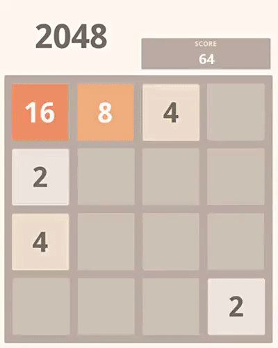

# 2048

2048 is a sliding block puzzle game designed by [Gabriele Cirulli](https://gabrielecirulli.com/).

## Features

### 1. To let you play

### 2. To play

  

## Timeline

- **2016** — Reconstructed with C++.
- **2014** — Project started. AI reached 2048 two days after launch.

## Prerequisites

- SDL 2.0, SDL_image 2.0, and SDL_ttf 2.0 are required.
- `font.ttf` must be placed in `./src/resources`. **Gadugi Bold** is recommended.
